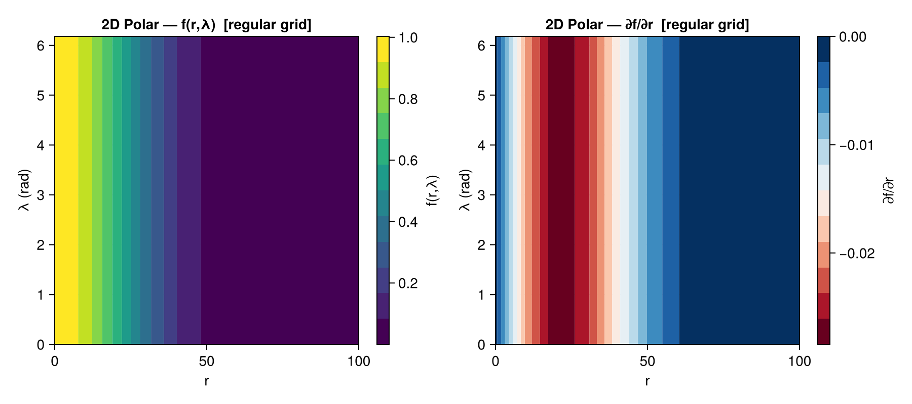
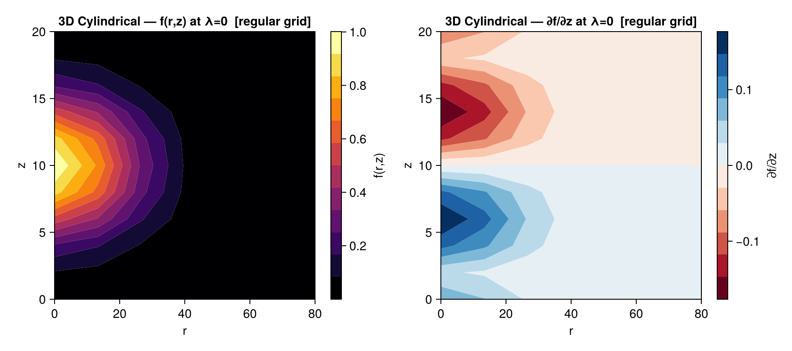
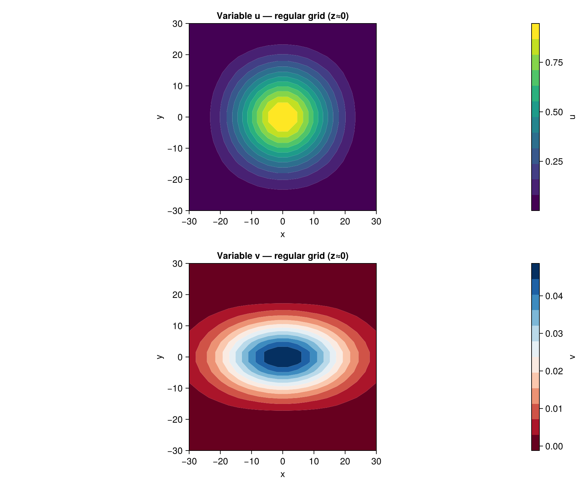
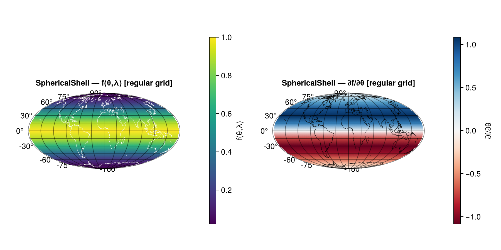
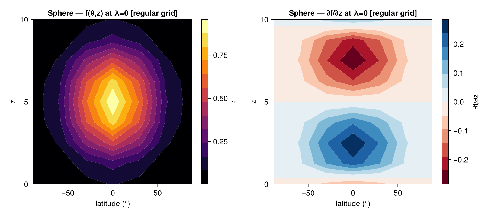
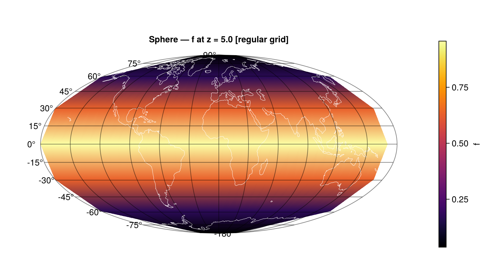

```@meta
CurrentModule = Springsteel
```

# Tutorial

This tutorial demonstrates Springsteel's core workflow through six examples of
increasing complexity. Each example creates a grid, fills it with a Gaussian
function, performs a forward (physical → spectral) and inverse (spectral → physical)
round-trip transform, and examines the results.

A companion Jupyter notebook with visualizations is available at
`notebooks/Springsteel_tutorial.ipynb`.

---

## Example 1 — 1D Spline Grid

The simplest Springsteel grid uses **cubic B-splines** in a single dimension.

### Creating the grid

Use [`SpringsteelGridParameters`](@ref) to configure the grid, then [`createGrid`](@ref) to
build it:

```julia
using Springsteel

gp = SpringsteelGridParameters(
    geometry  = "R",            # 1D radial/Cartesian
    iMin      = -50.0,          # domain left bound
    iMax      = 50.0,           # domain right bound
    num_cells = 30,             # B-spline cells (iDim = 30 × 3 = 90 gridpoints)
    BCL       = Dict("gauss" => CubicBSpline.R0),   # left BC: free boundary (rank-0, no constraint)
    BCR       = Dict("gauss" => CubicBSpline.R0),   # right BC: free boundary (rank-0, no constraint)
    vars      = Dict("gauss" => 1)                   # one variable
)

grid = createGrid(gp)
```

The result is a `SpringsteelGrid{CartesianGeometry, SplineBasisArray, NoBasisArray, NoBasisArray}`,
which can also be referred to by the type alias `R_Grid`.

**Physical array dimensions**: `(iDim, n_vars, 3)` — the third dimension holds
`[f, ∂f/∂x, ∂²f/∂x²]`.

### Filling the grid

Use [`getGridpoints`](@ref) to retrieve the physical gridpoint coordinates:

```julia
pts = getGridpoints(grid)   # Vector{Float64} of length iDim

σ = 10.0
for i in eachindex(pts)
    grid.physical[i, 1, 1] = exp(-(pts[i] / σ)^2)
end
```

### Round-trip transform

```julia
spectralTransform!(grid)   # physical → spectral coefficients
gridTransform!(grid)        # spectral → physical + derivatives

# Check accuracy
original = exp.(-(pts ./ σ).^2)
max_error = maximum(abs.(grid.physical[:, 1, 1] .- original))
# max_error ≈ 1e-6 for 30 cells
```

After [`gridTransform!`](@ref), the derivatives are available:
- `grid.physical[:, 1, 2]` — first derivative ∂f/∂x
- `grid.physical[:, 1, 3]` — second derivative ∂²f/∂x²

### Boundary conditions

BC constants follow the **Ooyama (2002)** rank–type naming convention, defined in the
[`CubicBSpline`](@ref CubicBSpline_module) module. The *rank* is the number of
constraints removed at the boundary; the *type* identifies which derivative is
constrained (T0 = value, T1 = first derivative, T2 = second derivative):

| Constant | Ooyama Eq. | Mathematical condition |
|:---|:---|:---|
| `CubicBSpline.R0` | 3.2a | No constraint (free boundary) |
| `CubicBSpline.R1T0` | 3.2b | ``u(x_0) = 0`` (Dirichlet) |
| `CubicBSpline.R1T1` | 3.2c | ``u'(x_0) = 0`` (Neumann) |
| `CubicBSpline.R1T2` | 3.2d | ``u''(x_0) = 0`` |
| `CubicBSpline.R2T10` | 3.2f | ``u(x_0) = u'(x_0) = 0`` (symmetric reflection) |
| `CubicBSpline.R2T20` | 3.2g | ``u(x_0) = u''(x_0) = 0`` (antisymmetric reflection) |
| `CubicBSpline.R3` | 3.2h | ``u = u' = u'' = 0`` at boundary |
| `CubicBSpline.PERIODIC` | §3e | Periodic (cyclically continuous) domain |

---

## Example 2 — 2D Polar Grid (Spline × Fourier)

A **cylindrical** (`"RL"`) grid uses B-splines in the radial direction and Fourier
series in azimuth.

### Key features
- Each radial ring has a **different number of azimuthal gridpoints**: `lpoints = 4 + 4rᵢ`,
  where `rᵢ = r + patchOffsetL`. This avoids over-resolving near the center.
- Fourier BCs are always periodic (set automatically).
- The physical array has **5 derivative slots**: `[f, ∂f/∂r, ∂²f/∂r², ∂f/∂λ, ∂²f/∂λ²]`.

### Grid creation

```julia
gp_rl = SpringsteelGridParameters(
    geometry  = "RL",
    iMin      = 0.0,
    iMax      = 100.0,
    num_cells = 10,
    vars      = Dict("gauss" => 1),
    BCL       = Dict("gauss" => CubicBSpline.R0),
    BCR       = Dict("gauss" => CubicBSpline.R0)
)

grid_rl = createGrid(gp_rl)  # RL_Grid
```

### Filling the grid

For cylindrical grids, gridpoints are packed by ring. Loop over radial
indices, compute ring sizes, and fill sequentially:

```julia
σ = 30.0
iDim = grid_rl.params.iDim
g = 1
for r in 1:iDim
    ri      = r + grid_rl.params.patchOffsetL
    lpoints = 4 + 4 * ri
    r_val   = grid_rl.ibasis.data[1, 1].mishPoints[r]
    val     = exp(-(r_val / σ)^2)
    for l in 1:lpoints
        grid_rl.physical[g, 1, 1] = val
        g += 1
    end
end
```

### Round-trip and gridpoints

```julia
original = copy(grid_rl.physical[:, 1, 1])
spectralTransform!(grid_rl)
gridTransform!(grid_rl)
max_error = maximum(abs.(grid_rl.physical[:, 1, 1] .- original))

# getGridpoints returns an (N, 2) matrix: columns are [r, λ]
pts_rl = getGridpoints(grid_rl)
```

### Evaluating on a regular grid

The cylindrical mish-point layout has irregular spacing (different `lpoints`
per ring). Use [`regularGridTransform`](@ref) to evaluate the spectral
representation on a uniform (r, λ) grid — ideal for plotting or
intercomparison:

```julia
# Default regular grid (uniform r × λ tensor-product grid)
reg_pts  = getRegularGridpoints(grid_rl)         # (N, 2) → columns [r, λ]
reg_vals = regularGridTransform(grid_rl, reg_pts) # (N, num_vars, 5)

# Or specify custom output points:
r_out = collect(range(0.0, 100.0, length=50))
λ_out = collect(range(0.0, 2π, length=72))
custom_vals = regularGridTransform(grid_rl, r_out, λ_out)
```

The returned array has the same derivative slots as `physical`:
`[f, ∂f/∂r, ∂²f/∂r², ∂f/∂λ, ∂²f/∂λ²]`.

**Reshape note**: Output is stored with λ varying fastest.  To obtain a
`(n_r × n_λ)` matrix `M` such that `M[i,j] = f(r_i, λ_j)`, use Julia's
column-major reshape:
```julia
n_r = grid_rl.params.i_regular_out
n_λ = grid_rl.params.j_regular_out
f_matrix = permutedims(reshape(reg_vals[:, 1, 1], n_λ, n_r))  # (n_r × n_λ)
```

This matrix can then be passed directly to `contourf` for scientific figures:
```julia
r_reg = collect(LinRange(gp_rl.iMin, gp_rl.iMax, n_r))
λ_reg = [2π*(j-1)/n_λ for j in 1:n_λ]
contourf(ax, r_reg, λ_reg, f_matrix; colormap=:viridis, levels=12)
```

See the [companion notebook](https://github.com/mmbell/Springsteel.jl/blob/main/notebooks/Springsteel_tutorial.ipynb)
for complete visualization examples including saved figures.


*Left: field values f(r,λ) on the regular grid. Right: radial derivative ∂f/∂r.*

---

## Example 3 — 3D Cylindrical Grid (Spline × Fourier × Chebyshev)

The **RLZ** grid combines all three basis types.

### Key features
- **Chebyshev** parameters: `kMin`, `kMax` set the vertical domain; `kDim` is the
  number of Chebyshev gridpoints.
- The physical array has **7 derivative slots**:
  `[f, ∂f/∂r, ∂²f/∂r², ∂f/∂λ, ∂²f/∂λ², ∂f/∂z, ∂²f/∂z²]`.
- Physical indexing: for each radius `r`, `lpoints` azimuthal points, each with
  `kDim` vertical points packed sequentially.

### Grid creation

```julia
gp_rlz = SpringsteelGridParameters(
    geometry  = "RLZ",
    iMin      = 0.0,
    iMax      = 80.0,
    num_cells = 6,
    kMin      = 0.0,
    kMax      = 20.0,
    kDim      = 10,
    vars      = Dict("gauss" => 1),
    BCL       = Dict("gauss" => CubicBSpline.R0),
    BCR       = Dict("gauss" => CubicBSpline.R0),
    BCB       = Dict("gauss" => Chebyshev.R0),
    BCT       = Dict("gauss" => Chebyshev.R0)
)

grid_rlz = createGrid(gp_rlz)  # RLZ_Grid
```

### Filling the grid

```julia
σ_r = 25.0; σ_z = 5.0
z₀  = (gp_rlz.kMin + gp_rlz.kMax) / 2

iDim = grid_rlz.params.iDim
kDim = grid_rlz.params.kDim
idx  = 1
for r in 1:iDim
    ri      = r + grid_rlz.params.patchOffsetL
    lpoints = 4 + 4 * ri
    r_val   = grid_rlz.ibasis.data[1, 1].mishPoints[r]
    for l in 1:lpoints
        for z in 1:kDim
            z_val = grid_rlz.kbasis.data[1].mishPoints[z]
            grid_rlz.physical[idx, 1, 1] = exp(-(r_val/σ_r)^2 - ((z_val - z₀)/σ_z)^2)
            idx += 1
        end
    end
end
```

### Round-trip

```julia
original = copy(grid_rlz.physical[:, 1, 1])
spectralTransform!(grid_rlz)
gridTransform!(grid_rlz)
max_error = maximum(abs.(grid_rlz.physical[:, 1, 1] .- original))
```

### Evaluating on a regular grid

```julia
reg_pts  = getRegularGridpoints(grid_rlz)          # (N, 3) → columns [r, λ, z]
reg_vals = regularGridTransform(grid_rlz, reg_pts)  # (N, num_vars, 7)

# Custom output grid
r_out = collect(range(0.0, 80.0, length=40))
λ_out = collect(range(0.0, 2π, length=36))
z_out = collect(range(0.0, 20.0, length=20))
custom_vals = regularGridTransform(grid_rlz, r_out, λ_out, z_out)
```

The returned array has 7 derivative slots:
`[f, ∂f/∂r, ∂²f/∂r², ∂f/∂λ, ∂²f/∂λ², ∂f/∂z, ∂²f/∂z²]`.

To extract an `(r, z)` cross-section at a fixed `λ`-index for contour plotting:
```julia
n_r = grid_rlz.params.i_regular_out
n_λ = grid_rlz.params.j_regular_out
n_z = grid_rlz.params.k_regular_out
# λ_idx = 1 (first point, λ = 0)
# flat = (ri-1)*n_λ*n_z + (λ_idx-1)*n_z + zi
f_rz = [reg_vals[(ri-1)*n_λ*n_z + zi, 1, 1] for ri in 1:n_r, zi in 1:n_z]
r_reg = collect(LinRange(gp_rlz.iMin, gp_rlz.iMax, n_r))
z_reg = collect(LinRange(gp_rlz.kMin, gp_rlz.kMax, n_z))
contourf(ax, r_reg, z_reg, f_rz; colormap=:inferno, levels=12)
```


*Left: f(r,z) at λ=0. Right: vertical derivative ∂f/∂z.*

---

## Example 4 — 3D Cartesian Grid (Spline × Spline × Spline) with Two Variables

The **RRR** grid uses cubic B-splines in all three dimensions.

### Key features
- BCs are needed for all three directions: `BCL`/`BCR` (i), `BCU`/`BCD` (j),
  `BCB`/`BCT` (k).
- Physical indexing: `flat = (i-1)*jDim*kDim + (j-1)*kDim + k`.
- **Multiple variables**: assign each a unique integer index in `vars`.

### Grid creation with two variables

```julia
gp_rrr = SpringsteelGridParameters(
    geometry  = "RRR",
    iMin      = -30.0,  iMax = 30.0,
    jMin      = -30.0,  jMax = 30.0,
    kMin      = -30.0,  kMax = 30.0,
    num_cells = 6,
    vars      = Dict("u" => 1, "v" => 2),
    BCL = Dict("u" => CubicBSpline.R0, "v" => CubicBSpline.R0),
    BCR = Dict("u" => CubicBSpline.R0, "v" => CubicBSpline.R0),
    BCU = Dict("u" => CubicBSpline.R0, "v" => CubicBSpline.R0),
    BCD = Dict("u" => CubicBSpline.R0, "v" => CubicBSpline.R0),
    BCB = Dict("u" => CubicBSpline.R0, "v" => CubicBSpline.R0),
    BCT = Dict("u" => CubicBSpline.R0, "v" => CubicBSpline.R0)
)

grid_rrr = createGrid(gp_rrr)  # RRR_Grid — 2 variables, 7 derivative slots each
```

### Filling multiple variables

[`getGridpoints`](@ref) returns an `(N, 3)` matrix for 3D Cartesian grids:

```julia
pts = getGridpoints(grid_rrr)   # (N, 3) → columns [x, y, z]

σ_iso = 15.0;  σ_x = 20.0;  σ_y = 10.0

for i in 1:size(pts, 1)
    x, y, z = pts[i, 1], pts[i, 2], pts[i, 3]
    grid_rrr.physical[i, 1, 1] = exp(-(x^2 + y^2 + z^2) / σ_iso^2)
    grid_rrr.physical[i, 2, 1] = exp(-x^2/σ_x^2 - y^2/σ_y^2) * (z / 30.0)
end
```

### Round-trip

```julia
orig_u = copy(grid_rrr.physical[:, 1, 1])
orig_v = copy(grid_rrr.physical[:, 2, 1])

spectralTransform!(grid_rrr)
gridTransform!(grid_rrr)

err_u = maximum(abs.(grid_rrr.physical[:, 1, 1] .- orig_u))
err_v = maximum(abs.(grid_rrr.physical[:, 2, 1] .- orig_v))
```

Both variables are transformed simultaneously — the spectral and inverse transforms
operate on all variables in a single call.

### Evaluating on a regular grid

For Cartesian grids, pass explicit output vectors directly — this gives a
clean symmetric grid independent of the internal mish-point density:

```julia
# Pass explicit output vectors (cleaner than getRegularGridpoints for Cartesian)
n_out = 20
x_out = collect(LinRange(gp_rrr.iMin, gp_rrr.iMax, n_out))
y_out = collect(LinRange(gp_rrr.jMin, gp_rrr.jMax, n_out))
z_out = collect(LinRange(gp_rrr.kMin, gp_rrr.kMax, n_out))
reg_vals = regularGridTransform(grid_rrr, x_out, y_out, z_out)  # (n_out³, 2, 7)
```

All variables are evaluated simultaneously — both `u` and `v` appear in the output.

To extract an `(x, y)` slice at a fixed `z`-index for contourf:
```julia
# z varies fastest → flat = (xi-1)*n_out² + (yj-1)*n_out + zi
k_mid = div(n_out, 2) + 1
u_xy = [reg_vals[(xi-1)*n_out^2 + (yj-1)*n_out + k_mid, 1, 1]
        for xi in 1:n_out, yj in 1:n_out]
contourf(ax, x_out, y_out, u_xy; colormap=:viridis, levels=12)
```


*Both variables on the regular grid x-y slice at z≈0.*

---

## Example 5 — 2D Spherical Shell Grid (Spline × Fourier)

The **SphericalShell** (`"SL"`) grid uses B-splines in the colatitude (θ) direction
and Fourier series in longitude (λ).

### Key features
- The colatitude domain is `[iMin, iMax]` in radians (e.g. `0.01π` to `0.99π` to
  exclude the poles where the Fourier ring collapses).
- **Variable azimuthal resolution**: like the `RL` grid, each colatitude ring
  has `lpoints = k*2` Fourier points where `k` is the ring's radial index.
- Coordinate convention: `i` = colatitude θ ∈ (0, π), `j` = longitude λ ∈ [0, 2π).
- The physical array has **5 derivative slots**: `[f, ∂f/∂θ, ∂²f/∂θ², ∂f/∂λ, ∂²f/∂λ²]`.

### Grid creation

```julia
gp_sl = SpringsteelGridParameters(
    geometry  = "SphericalShell",   # or "SL"
    iMin      = 0.01 * π,           # south-polar exclusion zone
    iMax      = 0.99 * π,           # north-polar exclusion zone
    num_cells = 12,
    vars      = Dict("gauss" => 1),
    BCL       = Dict("gauss" => CubicBSpline.R0),
    BCR       = Dict("gauss" => CubicBSpline.R0)
)

grid_sl = createGrid(gp_sl)  # SL_Grid / SphericalShell_Grid
```

### Filling the grid

[`getGridpoints`](@ref) returns an `(N, 2)` matrix with columns `[θ, λ]`:

```julia
σ_θ = π / 4   # Gaussian half-width in colatitude
pts_sl = getGridpoints(grid_sl)
for i in 1:size(pts_sl, 1)
    θ = pts_sl[i, 1]
    grid_sl.physical[i, 1, 1] = exp(-((θ - π/2) / σ_θ)^2)
end
```

### Round-trip

```julia
original_sl = copy(grid_sl.physical[:, 1, 1])
spectralTransform!(grid_sl)
gridTransform!(grid_sl)
max_error_sl = maximum(abs.(grid_sl.physical[:, 1, 1] .- original_sl))
# max_error_sl ≈ 8e-4 for 12 cells
```

### Evaluating on a regular grid

Use [`regularGridTransform`](@ref) + [`getRegularGridpoints`](@ref) to obtain a
uniform (θ × λ) tensor-product grid:

```julia
reg_pts_sl  = getRegularGridpoints(grid_sl)             # (N, 2) → [θ, λ]
reg_phys_sl = regularGridTransform(grid_sl, reg_pts_sl) # (N, 1, 5)
```

**Reshape note**: output is stored with λ varying fastest. A `(n_λ × n_θ)` matrix
suitable for GeoMakie `surface!` is:
```julia
n_θ_sl = grid_sl.params.i_regular_out
n_λ_sl = grid_sl.params.j_regular_out
f_mat_sl = reshape(reg_phys_sl[:, 1, 1], n_λ_sl, n_θ_sl)  # (n_λ × n_θ)
```

For **GeoMakie** Mollweide projections, latitudes must be in ascending order:
```julia
using GeoMakie, CairoMakie
lon_sl = λ_reg_sl .* (180/π) .- 180.0          # → [-180, 180)
lat_sl = 90.0 .- θ_reg_sl .* (180/π)           # colatitude → latitude
perm   = sortperm(lat_sl)
fig = Figure()
ga  = GeoAxis(fig[1,1]; dest = "+proj=moll", title = "SphericalShell Gaussian")
surface!(ga, lon_sl, lat_sl[perm], f_mat_sl[:, perm];
         colormap = :viridis, shading = NoShading)
lines!(ga, GeoMakie.coastlines(); color = :white, linewidth = 0.5)
Colorbar(fig[1, 2], label = "f")
```


*Spherical shell Gaussian on a Mollweide projection. Coastlines are overlaid as a
geographic reference.*

---

## Example 6 — 3D Sphere Grid (Spline × Fourier × Chebyshev)

The **Sphere** (`"SLZ"`) grid adds a Chebyshev dimension in the radial/depth direction
to the spherical shell, giving a fully 3D spectral representation.

### Key features
- `iMin`/`iMax` — colatitude bounds; `kMin`/`kMax`/`kDim` — vertical (z) domain.
- The physical array has **7 derivative slots**:
  `[f, ∂f/∂θ, ∂²f/∂θ², ∂f/∂λ, ∂²f/∂λ², ∂f/∂z, ∂²f/∂z²]`.
- Physical indexing: z varies fastest, then λ, then θ.

### Grid creation

```julia
gp_slz = SpringsteelGridParameters(
    geometry  = "Sphere",       # or "SLZ"
    iMin      = 0.01 * π,
    iMax      = 0.99 * π,
    num_cells = 6,
    kMin      = 0.0,
    kMax      = 10.0,
    kDim      = 8,
    vars      = Dict("gauss" => 1),
    BCL = Dict("gauss" => CubicBSpline.R0),
    BCR = Dict("gauss" => CubicBSpline.R0),
    BCB = Dict("gauss" => Chebyshev.R0),
    BCT = Dict("gauss" => Chebyshev.R0)
)

grid_slz = createGrid(gp_slz)  # SLZ_Grid / Sphere_Grid
```

### Filling the grid

[`getGridpoints`](@ref) returns an `(N, 3)` matrix with columns `[θ, λ, z]`:

```julia
σ_θ_slz = π / 4;  σ_z_slz = 3.0;  z₀_slz = 5.0
pts_slz = getGridpoints(grid_slz)
for i in 1:size(pts_slz, 1)
    θ, λ, z = pts_slz[i, 1], pts_slz[i, 2], pts_slz[i, 3]
    grid_slz.physical[i, 1, 1] = exp(-((θ - π/2)/σ_θ_slz)^2 - ((z - z₀_slz)/σ_z_slz)^2)
end
```

### Round-trip

```julia
original_slz = copy(grid_slz.physical[:, 1, 1])
spectralTransform!(grid_slz)
gridTransform!(grid_slz)
max_error_slz = maximum(abs.(grid_slz.physical[:, 1, 1] .- original_slz))
# max_error_slz ≈ 8e-3 for 6 cells
```

### Evaluating on a regular grid

```julia
reg_pts_slz  = getRegularGridpoints(grid_slz)              # (N, 3) → [θ, λ, z]
reg_phys_slz = regularGridTransform(grid_slz, reg_pts_slz) # (N, 1, 7)
```

The output layout is: **z fastest, λ second, θ outer** (same as `RLZ`).
Flat index: `flat = (ti-1)*n_λ*n_z + (li-1)*n_z + zi`.

To extract a **(θ, z) cross-section** at `λ = 0` for contourf:
```julia
n_θ_slz = grid_slz.params.i_regular_out
n_λ_slz = grid_slz.params.j_regular_out
n_z_slz = grid_slz.params.k_regular_out
θ_reg = collect(LinRange(gp_slz.iMin, gp_slz.iMax, n_θ_slz))
z_reg = collect(LinRange(gp_slz.kMin, gp_slz.kMax, n_z_slz))
# λ-index 1 (λ = 0): flat = (ti-1)*n_λ_slz*n_z_slz + zi
f_tz  = [reg_phys_slz[(ti-1)*n_λ_slz*n_z_slz + zi, 1, 1]
         for ti in 1:n_θ_slz, zi in 1:n_z_slz]
lat_reg = 90.0 .- θ_reg .* (180/π)
contourf(ax, lat_reg, z_reg, f_tz; colormap = :inferno, levels = 12)
```

To produce a **GeoMakie surface at a fixed z-level**:
```julia
k_mid = div(n_z_slz, 2) + 1
f_surf = [reg_phys_slz[(ti-1)*n_λ_slz*n_z_slz + (li-1)*n_z_slz + k_mid, 1, 1]
          for li in 1:n_λ_slz, ti in 1:n_θ_slz]   # (n_λ × n_θ)
lon_slz = [2π*(j-1)/n_λ_slz for j in 1:n_λ_slz] .* (180/π) .- 180.0
lat_slz = 90.0 .- θ_reg .* (180/π)
perm_slz = sortperm(lat_slz)
fig = Figure()
ga  = GeoAxis(fig[1,1]; dest = "+proj=moll")
surface!(ga, lon_slz, lat_slz[perm_slz], f_surf[:, perm_slz];
         colormap = :inferno, shading = NoShading)
lines!(ga, GeoMakie.coastlines(); color = :white, linewidth = 0.5)
```


*Left: f(θ,z) at λ=0. Right: vertical derivative ∂f/∂z.*


*Gaussian on the sphere at z = z_mid, Mollweide projection.*

---

## Summary: Core Workflow

```julia
# 1. Configure
gp = SpringsteelGridParameters(geometry = "...", ...)

# 2. Build
grid = createGrid(gp)

# 3. Fill physical data
grid.physical[:, var_index, 1] .= your_data

# 4. Forward transform
spectralTransform!(grid)

# 5. Inverse transform (fills values + derivatives)
gridTransform!(grid)

# 6. (Optional) Evaluate on a regular output grid
reg_pts  = getRegularGridpoints(grid)            # uniform tensor-product grid
reg_vals = regularGridTransform(grid, reg_pts)   # or pass r_pts, λ_pts, z_pts directly
```

All legacy type names (`R_Grid`, `RL_Grid`, `RZ_Grid`, `RR_Grid`, `RLZ_Grid`, `RRR_Grid`,
`SL_Grid`, `SphericalShell_Grid`, `SLZ_Grid`, `Sphere_Grid`)
remain available as type aliases for full backward compatibility.

### Supported grid geometries

| Geometry string | Basis functions | Type alias |
|:---|:---|:---|
| `"R"` / `"Spline1D"` | Spline | `R_Grid` / `Spline1D_Grid` |
| `"RL"` | Spline × Fourier | `RL_Grid` |
| `"RZ"` | Spline × Chebyshev | `RZ_Grid` |
| `"RR"` / `"Spline2D"` | Spline × Spline | `RR_Grid` / `Spline2D_Grid` |
| `"RLZ"` | Spline × Fourier × Chebyshev | `RLZ_Grid` |
| `"RRR"` | Spline × Spline × Spline | `RRR_Grid` |
| `"SL"` / `"SphericalShell"` | Spline × Fourier | `SL_Grid` / `SphericalShell_Grid` |
| `"SLZ"` / `"Sphere"` | Spline × Fourier × Chebyshev | `SLZ_Grid` / `Sphere_Grid` |

---

## I/O

Springsteel provides three I/O pathways:

| Format | Write | Read | Notes |
|:-------|:------|:-----|:------|
| CSV | `write_grid` | `read_physical_grid` | Human-readable; physical (mish-point) grid values |
| JLD2 | `save_grid` | `load_grid` | Binary; full round-trip including spectral coefficients |
| NetCDF | `write_netcdf` | `read_netcdf` | CF-1.12 compliant; regular output grid; language-agnostic |

### JLD2 — save and reload a grid

`save_grid` serialises the complete grid state (parameters, spectral coefficients,
physical array) to a compressed JLD2 binary file.  `load_grid` reconstructs the
full grid from the file, including fresh FFTW plans.

```julia
using Springsteel

# Build and transform a grid
gp = SpringsteelGridParameters(
    geometry="RL", num_cells=20, iMin=0.0, iMax=100.0,
    vars=Dict("u" => 1, "v" => 2),
    BCL=Dict("u" => CubicBSpline.R0, "v" => CubicBSpline.R0),
    BCR=Dict("u" => CubicBSpline.R0, "v" => CubicBSpline.R0))
grid = createGrid(gp)
# ... fill grid.physical and call spectralTransform! ...

# Save (zstd compression by default)
save_grid("simulation.jld2", grid)

# Load into a fresh session — FFTW plans are reconstructed automatically
grid2 = load_grid("simulation.jld2")
@assert grid2.spectral ≈ grid.spectral
gridTransform!(grid2)   # works immediately; plans are fresh
```

Use `compress=false` to skip compression (larger files, faster writes):
```julia
save_grid("simulation_uncompressed.jld2", grid; compress=false)
```

### NetCDF — write CF-compliant output

`write_netcdf` evaluates the spectral representation on a uniform tensor-product
grid and writes the result to a CF-1.12-compliant NetCDF file readable by any
NetCDF-aware tool (Python/xarray, MATLAB, NCO, ParaView, …).

```julia
spectralTransform!(grid)
write_netcdf("output.nc", grid)
```

By default only field values are written.  Pass `include_derivatives=true` to
also write first and second derivative variables:

```julia
write_netcdf("output.nc", grid; include_derivatives=true)
```

Extra CF global attributes (institution, references, …) can be provided:

```julia
write_netcdf("output.nc", grid;
    global_attributes=Dict{String,Any}(
        "institution" => "NCAR",
        "references"  => "doi:10.1000/example"))
```

Coordinate names follow the grid geometry:

| Grid type | Dimension names |
|:----------|:----------------|
| Cartesian (R, RR, RZ, RRR) | `x`, `y`, `z` |
| Cylindrical (RL, RLZ) | `radius`, `azimuth` (degrees), `height` |
| Spherical (SL, SLZ) | `latitude` (degrees_north), `longitude` (degrees_east), `height` |

### NetCDF — reading back with `read_netcdf`

`read_netcdf` returns a plain `Dict` with four keys: `"dimensions"`,
`"coordinates"`, `"variables"`, and `"attributes"`.  This is ready for
passing to plotting libraries or further Julia analysis.

```julia
data = read_netcdf("output.nc")

# Inspect contents
data["attributes"]["Conventions"]   # "CF-1.12"
x    = data["coordinates"]["x"]     # Vector{Float64}
u    = data["variables"]["u"]       # Array{Float64}

# Plot with CairoMakie
using CairoMakie
lines(x, u; label="u")
```

For a cylindrical grid the coordinate keys would be `"radius"` and `"azimuth"`;
for spherical, `"latitude"` and `"longitude"`.

> **Note**: `read_netcdf` returns data on the *regular output grid*, not the
> native mish-point grid.  To load field values back onto the mish-point grid
> (e.g. to restart a simulation), use `read_physical_grid` with a CSV file
> produced by `write_grid`.

---

## Example 7 — Solving a Boundary Value Problem

Springsteel includes a solver framework for linear boundary value problems.
This example solves the 1D Poisson equation ``u'' = f`` on a Chebyshev grid.

### Setting up the problem

```julia
using Springsteel

# Create a 1D Chebyshev grid with Dirichlet BCs
gp = SpringsteelGridParameters(
    geometry = "Z",
    iMin = 0.0, iMax = 1.0,
    iDim = 25, b_iDim = 25,
    BCL = Dict("u" => Chebyshev.R1T0),   # u(0) = 0
    BCR = Dict("u" => Chebyshev.R1T0),   # u(1) = 0
    vars = Dict("u" => 1))
grid = createGrid(gp)
```

### Assembling the operator

Use [`assemble_from_equation`](@ref) to build the second-derivative operator:

```julia
L = assemble_from_equation(grid, "u"; d_ii=1.0)
```

For multi-term operators (e.g., ``a u'' + b u' + c u = f``), pass multiple
keywords:

```julia
L = assemble_from_equation(grid, "u"; d_ii=a, d_i=b, d0=c)
```

### Defining the RHS and solving

```julia
pts = solver_gridpoints(grid, "u")
f = -pi^2 .* sin.(pi .* pts)   # RHS for u(x) = sin(πx)

prob = SpringsteelProblem(grid; operator=L, rhs=f)
sol = solve(prob)

# Check accuracy
u_exact = sin.(pi .* pts)
maximum(abs.(sol.physical .- u_exact))   # < 1e-4
```

The solver automatically applies Dirichlet boundary conditions by replacing
boundary rows in the operator matrix. The solution is returned as a
[`SpringsteelSolution`](@ref) containing both the spectral coefficients and
physical-space values.

### 2D boundary value problems

The solver extends naturally to multi-dimensional grids via Kronecker products.
For a 2D Poisson equation on a Chebyshev×Chebyshev grid:

```julia
gp2d = SpringsteelGridParameters(
    geometry = "ZZ",
    iMin = 0.0, iMax = 1.0, iDim = 20, b_iDim = 20,
    jMin = 0.0, jMax = 1.0, jDim = 20, b_jDim = 20,
    BCL = Dict("u" => Chebyshev.R1T0),
    BCR = Dict("u" => Chebyshev.R1T0),
    BCU = Dict("u" => Chebyshev.R1T0),
    BCD = Dict("u" => Chebyshev.R1T0),
    vars = Dict("u" => 1))
grid2d = createGrid(gp2d)

L2d = assemble_from_equation(grid2d, "u"; d_ii=1.0, d_jj=1.0)
```

The assembled operator ``\mathbf{L}`` automatically combines 1D matrices
via Kronecker products: ``\mathbf{L} = \mathbf{D}^2_i \otimes \mathbf{I}_j + \mathbf{I}_i \otimes \mathbf{D}^2_j``.
